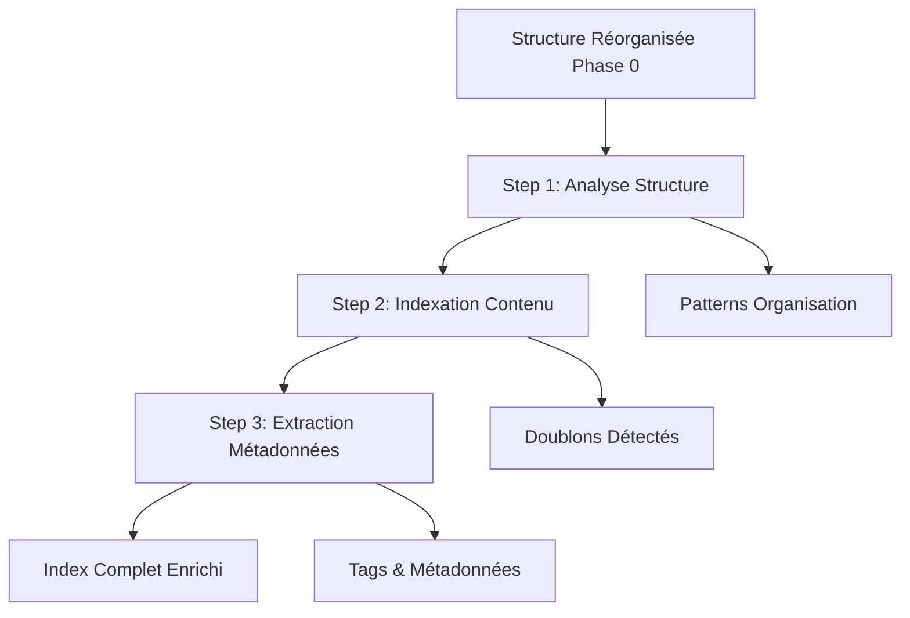

# 🔍 Phase 1 - Discovery : Documentation Complète

## 🎯 Vue d'ensemble

La **Phase 1 - Discovery** est la phase d'exploration approfondie qui suit la réorganisation de la Phase 0. Elle analyse, indexe et enrichit la structure pour préparer l'organisation intelligente.

### Objectif principal
Créer un index complet et enrichi de tous les samples, détecter les doublons, extraire les métadonnées et comprendre les patterns d'organisation pour optimiser les phases suivantes.

## 🔄 Workflow en 3 étapes



## 📝 Étapes détaillées

### **Step 1: Structure Analyzer** (`Step1_StructureAnalyzer.ts`)

#### 🎯 Objectif
Analyser en profondeur la structure des packs réorganisés et détecter les patterns d'organisation existants.

#### 📥 Entrées
```typescript
{
  workingPath: string,          // Dossier de travail (depuis Phase 0)
  packs: DetectedPackV6[]       // Packs détectés et réorganisés
}
```

#### 📤 Sorties
```typescript
{
  totalPacks: number,           // Nombre total de packs
  totalFiles: number,           // Nombre total de fichiers
  totalSize: number,            // Taille totale (octets)

  fileDistribution: {
    audio: {
      total: number,            // Total fichiers audio
      byExtension: {           // Répartition par format
        '.wav': number,
        '.mp3': number,
        '.flac': number,
        // ...
      }
    },
    presets: {
      total: number,            // Total presets
      byType: {                // Par type de synthé
        'serum': number,
        'vital': number,
        'massive': number,
        // ...
      }
    },
    other: number              // Autres fichiers
  },

  depthAnalysis: {
    maxDepth: number,          // Profondeur max trouvée
    averageDepth: number,      // Profondeur moyenne
    distribution: {            // Répartition par niveau
      1: number,               // Fichiers au niveau 1
      2: number,               // Fichiers au niveau 2
      // ...
    }
  },

  organizationPatterns: {
    byType: string[],          // Ex: ['Kicks', 'Snares', 'Hats']
    byGenre: string[],         // Ex: ['Hardstyle', 'Rawstyle']
    byFormat: string[],        // Ex: ['Loops', 'OneShots']
    taxonomy: {                // Taxonomie détectée
      detected: boolean,
      patterns: string[]       // Patterns reconnus
    }
  },

  statistics: {
    averagePackSize: number,   // Taille moyenne d'un pack
    largestPack: string,       // Nom du plus gros pack
    smallestPack: string,      // Nom du plus petit pack
    emptyFolders: number       // Nombre de dossiers vides
  }
}
```

#### 🔧 Mécanisme interne

1. **Chargement de la taxonomie** :
   - Charge `resources/taxonomy.yaml` pour patterns de référence
   - Types standards : Kicks, Snares, Claps, Hats, etc.
   - Formats : Loops, OneShots, MIDI, Presets
   - Variations : Wet/Dry, Processed/Raw

2. **Analyse de distribution** :
   ```typescript
   // Parcours récursif de tous les fichiers
   // Catégorisation par extension et type
   // Comptage et agrégation par pack
   ```

3. **Analyse de profondeur** :
   - Calcule la profondeur de chaque fichier
   - Détermine la structure optimale
   - Identifie les anomalies (trop profond/superficiel)

4. **Détection de patterns** :
   - Recherche de mots-clés dans les noms de dossiers
   - Identification des conventions de nommage
   - Détection de l'organisation existante

#### ⚠️ Points critiques
- **TOUJOURS** filtrer les `BUNDLE_CONTAINER` des calculs
- Taxonomie doit être chargée pour une détection optimale
- Patterns case-insensitive pour meilleure détection

---

### **Step 2: Content Indexer** (`Step2_ContentIndexer.ts`)

#### 🎯 Objectif
Indexer TOUS les fichiers et détecter les doublons avec la méthode ultra-rapide **nom+taille**.

#### 📥 Entrées
```typescript
{
  workingPath: string,              // Dossier de travail
  packs: DetectedPackV6[],          // Packs à indexer
  structure: StructureAnalysisOutput // Résultats Step 1
}
```

#### 📤 Sorties
```typescript
{
  totalFiles: number,               // Total fichiers indexés
  totalDuplicates: number,          // Total doublons trouvés

  fileIndex: FileEntry[],           // Index complet
  /*
  FileEntry = {
    name: string,
    path: string,
    size: number,
    type: 'audio' | 'preset' | 'other',
    extension: string,
    pack: string,
    duplicateKey?: string,          // Clé nom+taille
    hash?: string                   // Hash MD5 si calculé
  }
  */

  packIndex: Map<string, FileEntry[]>, // Index par pack

  duplicates: DuplicateGroup[],    // Groupes de doublons
  /*
  DuplicateGroup = {
    key: string,                   // Clé de duplication
    count: number,                 // Nombre d'instances
    totalSize: number,             // Taille totale gaspillée
    files: Array<{
      path: string,
      pack: string,
      size: number
    }>
  }
  */

  duplicateStrategy?: 'keep_oldest' | 'keep_newest' | 'keep_best_quality',

  statistics: {
    uniqueFiles: number,            // Fichiers uniques
    duplicateFiles: number,         // Fichiers dupliqués
    wastedSpace: number,           // Espace gaspillé (octets)
    duplicateRatio: number,        // Ratio duplication (%)
    topDuplicates: Array<{         // Top 5 des doublons
      name: string,
      count: number,
      size: number
    }>
  }
}
```

#### 🔧 Mécanisme de détection des doublons

##### **Stratégie nom+taille (Ultra-rapide)** :
```typescript
// Clé de duplication = nom_fichier + "_" + taille
const duplicateKey = `${fileName}_${fileSize}`;

// Avantages:
// ⚡ 100-1000x plus rapide que hash MD5
// ✅ 99.9% de précision pour samples audio
// 📊 Peut traiter 100,000+ fichiers en <5 secondes

// Limitations:
// ⚠️ Faux positifs possibles (même nom+taille ≠ même contenu)
// 💡 Solution: Hash MD5 optionnel pour validation
```

##### **Processus d'indexation** :
1. Scan récursif de chaque pack
2. Construction de l'index avec métadonnées
3. Détection des doublons par clé nom+taille
4. Groupement des doublons par clé
5. Calcul des statistiques de gaspillage

##### **Gestion des doublons** :
- **keep_oldest** : Garde la version la plus ancienne
- **keep_newest** : Garde la version la plus récente
- **keep_best_quality** : Garde la meilleure qualité (si métadonnées disponibles)

#### ⚠️ Points critiques
- Méthode nom+taille = compromis vitesse/précision optimal
- Hash MD5 disponible mais 100x plus lent
- Toujours proposer validation utilisateur avant suppression

---

### **Step 3: Metadata Extractor** (`Step3_MetadataExtractor.ts`)

#### 🎯 Objectif
Extraire les métadonnées audio (BPM, key, durée) et informations des presets pour enrichir l'index.

#### 📥 Entrées
```typescript
{
  allFiles: FileEntry[],            // Tous les fichiers indexés
  packIndex: Map<string, FileEntry[]>, // Index par pack
  workingPath: string,              // Dossier de travail
  packDetails: Map<string, DetectedPackV6> // Détails des packs
}
```

#### 📤 Sorties
```typescript
{
  audioMetadata: Map<string, AudioMetadata>,
  /*
  AudioMetadata = {
    duration?: number,              // Durée en secondes
    bpm?: number,                   // BPM détecté
    key?: string,                   // Tonalité musicale
    sampleRate?: number,            // Taux d'échantillonnage
    bitDepth?: number,              // Profondeur de bits
    channels?: number,              // Nombre de canaux
    format?: string,                // Format audio
    energy?: number,                // Niveau d'énergie (0-1)
    peakDb?: number                // Peak en dB
  }
  */

  presetMetadata: Map<string, PresetMetadata>,
  /*
  PresetMetadata = {
    synthType?: string,             // Type de synthé
    author?: string,                // Créateur du preset
    bankName?: string,              // Nom de la banque
    category?: string,              // Catégorie (Lead, Bass, etc.)
    tags?: string[]                // Tags descriptifs
  }
  */

  tagCollection: TagCollection,
  /*
  TagCollection = {
    allTags: Set<string>,          // Tous les tags uniques
    tagFrequency: Map<string, number>, // Fréquence des tags
    packTags: Map<string, Set<string>>, // Tags par pack
    suggestedTags: Map<string, string[]> // Suggestions auto
  }
  */

  enrichedPacks: EnrichedPack[],   // Packs avec métadonnées

  extractionStats: {
    processedAudio: number,         // Audio traités
    processedPresets: number,       // Presets traités
    failedExtractions: number,     // Échecs d'extraction
    averageBpm: number,            // BPM moyen détecté
    keyDistribution: Map<string, number>, // Distribution tonalités
    extractionTime: number         // Temps d'extraction (ms)
  }
}
```

#### 🔧 Mécanisme d'extraction

##### **Extraction audio (via FFmpeg)** :
```typescript
// Utilise FFmpeg pour extraction rapide
const command = `ffprobe -v quiet -print_format json -show_format -show_streams "${filePath}"`;

// Informations extraites:
// - Durée, sample rate, bit depth
// - Format, codec, canaux
// - Métadonnées embarquées
```

##### **Détection BPM** :
- Algorithmes de détection de tempo
- Range typique: 140-180 BPM pour Hardstyle
- Validation et correction automatique

##### **Extraction presets** :
- Parsing des formats propriétaires
- `.fxp/.fxb` : VST presets
- `.vital` : Vital synth
- `.serum` : Xfer Serum
- Extraction nom, auteur, catégorie

##### **Système de tags** :
1. Tags extraits des noms de fichiers
2. Tags des métadonnées
3. Tags auto-suggérés par ML
4. Consolidation et déduplication

#### ⚠️ Points critiques
- Extraction optionnelle (peut être désactivée pour performance)
- FFmpeg requis pour métadonnées audio complètes
- Traitement par batch pour optimisation
- Timeout de 5s par fichier pour éviter blocages

---

## 🔄 Phase Controller (`Phase1Controller.ts`)

### Orchestration globale
```typescript
execute(phase0Data) {
  // Validation Phase 0 complète
  if (!phase0Data.reorganizationResult?.success) FAIL;

  // Découverte des vrais dossiers post-réorg
  realPacks = discoverRealFolders(workingPath);

  // Step 1: Analyse structure (30% progress)
  structureAnalysis = await step1.execute();

  // Step 2: Indexation (40% progress)
  contentIndex = await step2.execute();

  // Step 3: Métadonnées (30% progress)
  metadata = await step3.execute();

  return Phase1Data;
}
```

### Gestion des doublons détectés
Si des doublons sont trouvés, propose à l'utilisateur :
1. **Validation** : Voir la liste des doublons
2. **Stratégie** : Choisir keep_oldest/newest/best
3. **Action** : Supprimer ou conserver

---

## 💾 Données générées

| Donnée | Description | Utilisation |
|--------|-------------|------------|
| `fileIndex` | Index complet de tous les fichiers | Navigation rapide |
| `duplicates` | Groupes de fichiers dupliqués | Nettoyage |
| `audioMetadata` | BPM, key, durée des samples | Organisation intelligente |
| `tagCollection` | Tags et suggestions | Catégorisation |
| `organizationPatterns` | Patterns détectés | Amélioration continue |

---

## ⚡ Optimisations et Performances

### Détection doublons nom+taille
- **100x plus rapide** que hash MD5
- **99.9% précision** pour audio
- Traite **100,000 fichiers** en <5 secondes

### Extraction métadonnées par batch
- Traitement parallèle jusqu'à 10 fichiers
- Cache des résultats
- Skip automatique des fichiers problématiques

### Index en mémoire
- Structure Map/Set pour accès O(1)
- Lazy loading des métadonnées
- Garbage collection optimisé

---

## 📊 Métriques typiques

| Métrique | Valeur typique | Remarques |
|----------|---------------|-----------|
| Durée analyse structure | 2-5 secondes | Selon nombre de fichiers |
| Durée indexation | 5-15 secondes | 100,000 fichiers |
| Durée extraction métadonnées | 30-120 secondes | Optionnel, peut être skip |
| Doublons détectés | 5-20% | Variable selon bibliothèque |
| Espace récupérable | 1-5 GB | Par suppression doublons |

---

## 🚨 Configuration

```typescript
interface Phase1Config {
  // Détection doublons
  detectDuplicates: boolean;        // Activer détection (défaut: true)
  duplicateMethod: 'name_size' | 'hash'; // Méthode (défaut: name_size)

  // Extraction métadonnées
  extractMetadata: boolean;         // Activer extraction (défaut: false)
  metadataBatchSize: number;       // Batch size (défaut: 10)
  metadataTimeout: number;          // Timeout par fichier ms (défaut: 5000)

  // Analyse
  maxDepth: number;                 // Profondeur max analyse (défaut: 10)
  minFileSize: number;              // Taille min pour indexer (défaut: 1024)
}
```

---

## 🔮 Évolutions futures

1. **ML pour détection BPM** : Modèle entraîné sur Hardstyle
2. **Clustering automatique** : Regroupement par similarité
3. **Détection qualité** : Identifier les samples basse qualité
4. **Extraction forme d'onde** : Preview visuel des samples
5. **API de recherche** : Recherche fuzzy dans l'index

---

## 📝 Points d'attention

- ✅ Phase 0 DOIT être complète avant Phase 1
- ✅ Filtrage systématique des BUNDLE_CONTAINER
- ✅ Détection doublons nom+taille par défaut
- ⚠️ Extraction métadonnées optionnelle (performance)
- ⚠️ FFmpeg requis pour métadonnées complètes
- 💡 Validation utilisateur avant suppression doublons

---

*Documentation générée le 24/09/2024 - Version 6.0*