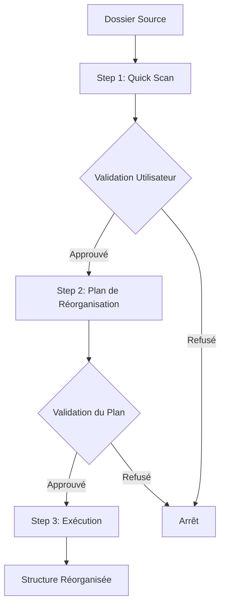

# 📋 Phase 0 - Préparation : Documentation Complète

## 🎯 Vue d'ensemble

La **Phase 0 - Préparation** est la phase initiale critique du pipeline d'organisation des samples. Elle analyse, détecte et réorganise la structure de base avant tout traitement approfondi.

### Objectif principal
Transformer un dossier de samples potentiellement chaotique en une structure propre et organisée, prête pour les phases de traitement suivantes.

## 🔄 Workflow en 3 étapes



## 📝 Étapes détaillées

### **Step 1: Quick Scan** (`Step1_QuickScan.ts`)

#### 🎯 Objectif
Scanner rapidement le dossier source pour détecter les packs de samples et analyser l'état du chaos.

#### 📥 Entrées
```typescript
{
  sourcePath: string,        // Chemin du dossier à scanner
  config?: {
    maxDepth?: number,       // Profondeur max de scan (défaut: 4)
    excludePatterns?: string[], // Patterns à ignorer
    minAudioFiles?: number   // Min de fichiers audio pour un pack (défaut: 10)
  }
}
```

#### 📤 Sorties
```typescript
{
  detectedPacks: DetectedPack[], // Packs détectés
  totalSamples: number,          // Nombre total de samples
  totalSize: number,             // Taille totale en octets
  needsCleanup: boolean,         // Nécessite nettoyage?
  chaosScore: number,            // Score de chaos (0-1)
  currentStructure: 'chaotic' | 'organized' | 'mixed',
  scanDuration: number,          // Durée du scan en ms
  packPreview: PackPreview[]     // Aperçu des packs principaux
}
```

#### 🔧 Mécanisme interne
1. **Capture du snapshot initial** : Crée `structure-originale.json` AVANT toute modification
2. **Détection V7** : Utilise exclusivement `PackDetectorV7Adapter` (pas de fallback)
3. **Analyse du chaos** : Calcule un score basé sur :
   - Profondeur des dossiers
   - Noms avec caractères spéciaux
   - Fichiers dispersés
   - Structure incohérente
4. **Filtrage** : Exclut automatiquement les `BUNDLE_CONTAINER` pour éviter le double comptage

#### ⚠️ Points critiques
- **TOUJOURS** créer le snapshot AVANT toute analyse
- **JAMAIS** compter les bundles dans les totaux (filtrage obligatoire)
- Score de chaos > 0.6 = nettoyage recommandé

---

### **Step 2: Clean & Reorganize Plan** (`Step2_CleanReorganize.ts`)

#### 🎯 Objectif
Générer un plan de réorganisation intelligent basé sur les packs détectés, SANS exécuter les changements.

#### 📥 Entrées
```typescript
{
  detectedPacks: DetectedPackV6[], // Packs du Step 1
  sourcePath: string,              // Chemin source
  proceedWithExecution?: boolean,  // false = planifier seulement
  config?: {
    workingPath?: string,          // Dossier de travail
    cleanNames?: boolean,          // Nettoyer les noms (défaut: true)
    unwrapFolders?: boolean,       // Déballer les wrappers (défaut: true)
    dryRun?: boolean              // Mode simulation
  }
}
```

#### 📤 Sorties (Mode Planification)
```typescript
{
  reorganizationPlan: {
    operations: ReorganizeOperation[], // Opérations planifiées
    plannedStats: {
      moveOperations: number,    // Déplacements prévus
      cleanOperations: number,   // Nettoyages de noms
      unwrapOperations: number,  // Déballages de dossiers
      deleteOperations: number,  // Suppressions prévues
      estimatedTimeSeconds: number // Temps estimé
    },
    planReport: FriendlyPlanReport // Rapport détaillé pour l'UI
  }
}
```

#### 🔧 Mécanisme du plan
1. **Analyse des packs** :
   - Identifie les packs à déplacer
   - Détecte les wrappers à déballer
   - Marque les noms à nettoyer

2. **Génération des opérations** :
   ```typescript
   type OperationType = 'move' | 'clean' | 'unwrap' | 'delete';
   ```

3. **Nettoyage des noms** (`NameCleanerV6`) :
   - Supprime `_1`, `_2` en fin de nom
   - Enlève les caractères spéciaux excessifs
   - Normalise les espaces et tirets
   - Préserve les tags importants `[Drums]`, `[Kicks]`, etc.

4. **Détection des wrappers** :
   - Dossier parent avec 1-2 sous-dossiers max
   - Sous-dossiers contenant les vrais samples
   - Ex: `Pack_Name/Pack_Name_v1/[samples]` → `Pack_Name/[samples]`

5. **Rapport utilisateur** :
   - Ton adapté au niveau de chaos (calm/energetic/urgent)
   - Statistiques visuelles
   - Plan d'action clair

#### ⚠️ Points critiques
- **TOUJOURS** générer le plan AVANT l'exécution
- **VALIDER** chaque opération avant ajout
- **PRÉSERVER** les métadonnées importantes

---

### **Step 3: Execute Reorganization** (`Step3_ExecuteReorganization.ts`)

#### 🎯 Objectif
Exécuter physiquement le plan de réorganisation validé par l'utilisateur.

#### 📥 Entrées
```typescript
{
  operations: ReorganizeOperation[], // Opérations du Step 2
  workingPath: string,               // Dossier de travail
  sourcePath: string,                // Dossier source
  config?: {
    createBackup?: boolean,          // Créer backup (défaut: true)
    dryRun?: boolean                // Mode simulation
  }
}
```

#### 📤 Sorties
```typescript
{
  success: boolean,
  movedPacks: number,        // Packs déplacés
  cleanedNames: number,      // Noms nettoyés
  unwrappedFolders: number,  // Dossiers déballés
  workingPath: string,       // Chemin final
  errors: string[],          // Erreurs rencontrées
  warnings: string[],        // Avertissements
  executionDuration: number  // Durée en ms
}
```

#### 🔧 Mécanisme d'exécution

##### **Stratégie de déplacement intelligent** :
```typescript
async moveFolder(source, target) {
  try {
    // 1. Tentative de DÉPLACEMENT rapide (rename)
    fs.renameSync(source, target);  // ⚡ ~2.5 secondes pour 137 packs
  } catch (error) {
    // 2. Si échec (cross-device), alors COPIER + SUPPRIMER
    await copyFolderRecursive(source, target);
    fs.rmSync(source, { recursive: true });
  }
}
```

##### **Gestion des collisions** :
- Si le dossier cible existe déjà → ajoute `_1`, `_2`, etc.
- Préserve l'intégrité des données

##### **Opération "Unwrap"** :
```typescript
// Avant : Pack_Folder/Pack_Folder_v1/[samples]
// Après : Pack_Folder/[samples]
```
1. Trouve les packs internes
2. Remonte le contenu d'un niveau
3. Supprime les dossiers wrappers vides

#### ⚠️ Points critiques
- **TOUJOURS** utiliser `fs.renameSync` en premier (performances)
- **FALLBACK** sur copie uniquement si nécessaire
- **JAMAIS** écraser sans vérification
- **LOGGER** chaque opération pour traçabilité

---

## 🔄 Phase Controller (`Phase0Controller.ts`)

### Orchestration globale
Le contrôleur gère le flux complet et les transitions entre étapes :

```typescript
execute(input) {
  // 1. Capture snapshot initial (CRITIQUE!)
  captureInitialSnapshot(sourcePath);

  // 2. Step 1: Quick Scan
  step1Result = await step1.execute();
  if (userActionRequired) return PAUSE_FOR_VALIDATION;

  // 3. Step 2: Génération du plan
  step2Result = await step2.execute({ proceedWithExecution: false });
  if (userActionRequired) return PAUSE_FOR_VALIDATION;

  // 4. Step 3: Exécution (si approuvé)
  step3Result = await step3.execute();

  return COMPLETE;
}
```

### Points de reprise
- `resumeFromStep: 2` : Reprendre après validation du scan
- `resumeFromStep: 3` : Reprendre après validation du plan

---

## 💾 Fichiers générés

| Fichier | Description | Quand | Critique |
|---------|------------|-------|----------|
| `structure-originale.json` | Snapshot complet AVANT modifications | Début Step 1 | ✅ VITAL pour rollback |
| `structure-detection.json` | Snapshot léger pour détection | Avant Step 1 | ✅ Requis |
| `structure-proposee.json` | Structure après réorganisation | Fin Step 2 | 📊 Info |

---

## 🚨 Sécurités et Rollback

### Snapshot de sauvegarde
- **TOUJOURS** créé AVANT toute modification
- Contient la structure complète originale
- Permet rollback d'urgence via `emergency-rollback.js`

### Validation à chaque étape
1. ✅ Validation après scan initial
2. ✅ Validation du plan avant exécution
3. ✅ Possibilité d'arrêt à tout moment

### Rollback d'urgence
```bash
# Si problème après réorganisation
node scripts/emergency-rollback.js "D:\SAMPLES 3\#RAWSTYLE"
```

---

## ⚡ Optimisations et Performances

### Déplacement vs Copie
- **Priorité au déplacement** (`fs.rename`) : ~2.5s pour 137 packs
- **Copie uniquement si nécessaire** : cross-device ou erreur
- **Gain de performance** : 50x plus rapide que copie

### Filtrage des bundles
- Les `BUNDLE_CONTAINER` sont **TOUJOURS** exclus des calculs
- Évite le double comptage systématique
- Réduit la complexité des opérations

### Traitement par batch
- Opérations groupées par type
- Parallélisation quand possible
- Progress feedback en temps réel

---

## 📊 Métriques typiques

| Métrique | Valeur typique | Remarques |
|----------|---------------|-----------|
| Durée scan | 5-15 secondes | Selon taille |
| Durée plan | < 1 seconde | Calculs rapides |
| Durée exécution | 2-5 secondes | Si déplacements |
| Taux de réussite | > 95% | Échecs rares |
| Packs traités | 100-200 | Capacité normale |

---

## 🐛 Problèmes connus et solutions

### Double comptage de packs
**Problème** : Parents et enfants comptés séparément
**Solution** : `resolveConflicts()` garde toujours le parent

### Volume incorrect
**Problème** : Bundles inclus dans le total
**Solution** : Filtrer `type !== 'BUNDLE_CONTAINER'`

### Fichiers "copiés" au lieu de déplacés
**Problème** : Apparence de copie temporaire
**Réalité** : `fs.rename` avec gestion des collisions (_1, _2)
**Normal** : Comportement attendu pour éviter écrasements

---

## 🔮 Évolutions futures

1. **Logs détaillés** : Ajout de logs d'exécution persistants
2. **Rollback partiel** : Annuler opérations spécifiques
3. **Mode preview** : Visualiser changements avant exécution
4. **Détection intelligente** : ML pour améliorer détection de packs
5. **Parallélisation** : Traitement concurrent des opérations indépendantes

---

## 📝 Checklist de débogage

- [ ] Snapshot `structure-originale.json` créé ?
- [ ] Bundles filtrés dans les totaux ?
- [ ] Plan validé avant exécution ?
- [ ] Espace disque suffisant ?
- [ ] Permissions d'écriture OK ?
- [ ] Pas de fichiers verrouillés ?
- [ ] Script rollback disponible ?

---

*Documentation générée le 24/09/2024 - Version 6.0*